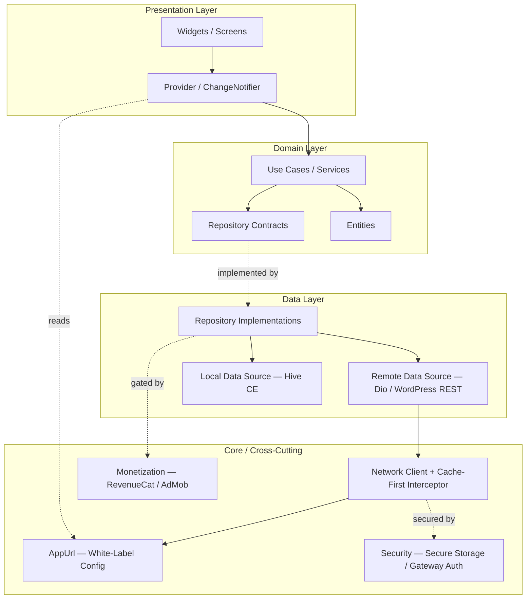

<div align="center">

# 🌱 Bloom Learning Platform
### Feature-First Clean Architecture Engine Powering a Portfolio of Subject-Specific Learning Apps


-FFB300?style=for-the-badge)


*One codebase. 30+ white-labeled study apps. One shared engine.*

</div>

---

## 📸 Screenshots & Demo

<div align="center">

| Home / Streaks | Quiz Engine | AI Tutor | Leaderboards |
|:---:|:---:|:---:|:---:|
|  |  |  |  |

</div>

---

## 🏆 Live Impact

> Verified directly against the live Play Store listing on Sep 18, 2026. Ratings fluctuate day to day — re-check before publishing if this README ages more than a few weeks.

| App | Subject | Downloads | Rating |
|---|---|---|---|
| **AP Biology Exam: Quiz & Prep** | Biology (AP) | **1M+** | **4.3 ★** (5,934 ratings) |

**30+ live apps** run on this single codebase — the flagship title alone has crossed **1M+ downloads**.

**Portfolio breadth** (verified from the live catalog — categories span far beyond STEM):

| Category | Example titles |
|---|---|
| Nursing / Clinical | Clinical Nursing Skills & NGN, Pharmacology for Nurses: NCLEX, Med-Surg, Maternal, Psych Nursing NCLEX & NGN |
| Business | Business Management, Business Law & Ethics, Business Statistics: AI Tutor, Startup & Business Plan, Economics: Micro, Macro |
| STEM / Math | College Algebra: Course & Quiz, Algebra & Trigonometry, Computer Science AI Tutor, Data Science: Learn with AI, Learn 3D Printing & CAD |
| Finance | Learn Accounting & Finance, Finance & Accounting AI Tutor |
| Humanities | Philosophy, Anthropology, Lifespan Development |
| Science | Biology Notes & Diagrams, AP Biology Exam: Quiz & Prep |
| Workplace | Workplace Skills: Office & PC |

Each title above is a thin brand/content shell over the exact same `lib/src/` engine documented below — that range, on one codebase, is the actual proof of the white-label architecture, not just a download count on one app.

---

## 📖 Overview

Bloom is the engineering core behind a family of subject-specific study apps (economics, biology, sociology, astronomy, etc.) that share one Clean Architecture foundation and one learning philosophy:

```
LEARN → PRACTICE → MAKE MISTAKES → ANALYZE → IDENTIFY WEAKNESSES → ADAPT → REVIEW → IMPROVE
```

It combines structured lesson content, a quiz/practice engine, spaced-repetition flashcards (SM-2), an automated mistake ledger, exam simulation, an AI-assisted tutor, and a full retention/gamification layer (streaks, XP, leaderboards, daily challenges) — all wired through a **cache-first, offline-resilient data layer**.

Each downstream app reuses this engine while keeping its own subject content, branding, and store positioning independent — a genuine **white-label product architecture**, not a copy-pasted fork per app.

### What this project demonstrates

| Skill | Evidence in this codebase |
|---|---|
| Flutter architecture | Feature-first modules under `lib/src/features/` + shared `lib/src/core/` |
| State management | `Provider` / `ChangeNotifier`, selective rebuilds |
| White-label engineering | Single config surface (`AppUrl`) driving 30+ apps |
| Backend integration | WordPress REST, Cloudflare gateway, Firebase |
| Monetization | Subscriptions, one-time IAPs, free-tier quotas, ads |
| AI UX | Subject-gated AI tutor, search, quiz generation via a secured gateway (no API secrets shipped in-app) |
| Retention & growth | Streaks, XP, leaderboards, friends, smart notifications |
| Engineering hygiene | Tests under `test/`, `Theme`/`AppColors` theming, offline-first Hive storage |

---

## 🏗️ Architecture

Clean Architecture, feature-first: each feature owns its own `domain / data / presentation`, and every feature depends inward on shared `core/` contracts — never sideways on another feature's implementation.



**Why this shape holds at 30+-app scale:**
- Presentation never imports a data-layer implementation — it only knows the domain contract, so swapping WordPress for a different CMS wouldn't touch a single widget.
- `AppUrl` is the *only* per-brand variable in the graph — every other node is shared, tested once, and reused everywhere.
- The cache-first interceptor sits below the repository, so offline behavior is a platform property, not something each feature has to reimplement.

---

## 🧩 White-Label Configuration

Every brand-specific detail — bundle ID, WordPress host, monetization IDs, store metadata — resolves through a single config surface. Feature code never hardcodes a subject, endpoint, or product ID.

```dart
/// lib/src/core/utils/app_urls.dart
///
/// Single source of truth for all per-brand configuration.
/// One class instance = one white-labeled app in the portfolio.
final class AppUrl {
  const AppUrl({
    required this.appId,
    required this.appName,
    required this.assetFolder,
    required this.playlistAssetFolder,
    required this.wpHost,
    required this.rootCategoryId,
    required this.revenueCatApiKey,
    required this.admobAppId,
    required this.appStoreId,
    required this.privacyPolicyUrl,
    required this.termsOfServiceUrl,
  });

  // --- Identity ---
  final String appId;
  final String appName;

  // --- Content ---
  final String assetFolder;
  final String playlistAssetFolder;
  final String wpHost;
  final int rootCategoryId;

  // --- Monetization ---
  final String revenueCatApiKey;
  final String admobAppId;

  // --- Store / Compliance ---
  final String appStoreId;
  final String privacyPolicyUrl;
  final String termsOfServiceUrl;
}

/// Injected once per build flavor — feature code depends on this
/// interface, never on a hardcoded subject string.
const AppUrl currentApp = AppUrl(
  appId: 'com.bloomstudio.biologypro',
  appName: 'Biology Pro',
  assetFolder: 'biology',
  playlistAssetFolder: 'biology_playlists',
  wpHost: 'https://biology.bloomcms.com',
  rootCategoryId: 12,
  revenueCatApiKey: String.fromEnvironment('REVENUECAT_KEY'),
  admobAppId: String.fromEnvironment('ADMOB_APP_ID'),
  appStoreId: '0000000000',
  privacyPolicyUrl: 'https://bloomstudio.dev/privacy/biology-pro',
  termsOfServiceUrl: 'https://bloomstudio.dev/terms/biology-pro',
);
```

> Secrets (`REVENUECAT_KEY`, `ADMOB_APP_ID`) are injected via `--dart-define` at build time per flavor — never committed, never hardcoded per brand.

---

## 🧱 Feature Modules

| Area | Capabilities |
|---|---|
| **Content** | WordPress courses, YouTube playlists, offline downloads |
| **Quiz** | Adaptive quizzes, exam simulator, ghost duels |
| **AI** | Socratic tutor, smart search, AI-generated quizzes (gateway-mediated) |
| **Study Tools** | Flashcards (SM-2 spaced repetition), smart study plan, mistakes ledger, notebook |
| **Gamification** | Streaks, XP, daily goals, leaderboards, friends & challenges |
| **Monetization** | RevenueCat subscriptions + AdMob mediation |
| **Retention** | Local notifications + FCM (premium tier skips retention locals) |
| **UI** | Light / Dark theming |

---

## ⚙️ Tech Stack

| Layer | Technology |
|---|---|
| Framework | Flutter 3.47.x / Dart 3.11.x |
| State Management | Provider / `ChangeNotifier` (selective rebuilds) |
| Local Storage | Hive CE (offline-first cache + structured records) |
| Networking | Dio, cache-first interceptor pattern |
| Backend | WordPress REST, Cloudflare gateway, Firebase |
| Monetization | RevenueCat, AdMob mediation |
| Notifications | Local notifications + Firebase Cloud Messaging |
| Auth / Security | Secure Storage, gateway-mediated AI endpoints (no client-side API secrets) |

---

## 🔁 State Management Conventions

- `Provider` / `ChangeNotifier` throughout — chosen over BLoC/Riverpod for this codebase's scope: 30+ thin brand shells over one engine benefit more from Provider's low ceremony than from BLoC's event/state boilerplate multiplied across every feature.
- Selective rebuilds via scoped `Consumer` / `Selector` — no top-level `notifyListeners()` calls that blow up the widget tree.
- ViewModels depend on domain **use cases**, never on data-layer implementations directly.

## 💾 Local Storage & Offline Strategy

- **Cache-first by default**: every repository checks Hive before hitting the network; network results backfill the cache.
- Hive-annotated entities (`streak_model`, `bookmark`, `flashcard_record`, `mistake_record`, `notification_prefs`, `completed_lessons`, `notebook_entry_record`) are code-generated (`.g.dart`) — never hand-edited.
- Offline downloads for lesson/video content are first-class, not a fallback.

## 🌐 Networking Layer

- Dio-based client, centralized through `core/network/`.
- All AI-related calls route through a secured gateway — the client app never holds a raw AI provider API key.
- WordPress REST is the content source of truth; Cloudflare fronts it for caching/rate-limiting.

## 🔒 Security

- No AI provider secrets shipped client-side — gateway holds and rotates keys.
- Secure Storage for sensitive local values (tokens, entitlement flags).
- `AppUrl`-scoped monetization keys injected per build flavor via `--dart-define`, not committed to source.

## 💰 Monetization

| Tier | Behavior |
|---|---|
| **Free** | Daily/weekly caps on AI, exams, lessons, study plan; ads on |
| **Premium** | Unlimited study/AI tools, ad-free, streak freezes & cosmetics |

IAP prices are resolved live via RevenueCat — never hardcoded.

## 🔔 Notifications & Retention Engine

- Local notifications drive daily-streak retention for free-tier users.
- FCM handles server-driven push (announcements, re-engagement campaigns).
- Premium users are exempt from retention-driven local notifications by design.

---

## 📂 Project Structure

```
lib/
├── firebase_options.dart
├── hive_registrar.g.dart
├── model/                      # ⚠️ legacy/shared models (api, hive, ai) — pre-migration
├── in-app purchase/            # ⚠️ legacy IAP module — pre feature-first migration
├── utils/                      # ⚠️ legacy top-level utils
└── src/
    ├── core/
    │   ├── monetization/ network/ security/
    │   ├── services/notifications/
    │   ├── storage/ theme/ utils/ widgets/
    └── features/
        ├── ai/ ai_tutor/ ai_history/
        ├── quiz/ quiz_engine/ exam_simulator/
        ├── flashcards/ mistakes/ notebook/ mastery/
        ├── streak/ gamification/ leaderboards/ daily_goals/
        ├── friends/ engagement/ retention/
        ├── educational_content/ smart_search/ smart_study_plan/
        ├── monetization/ notifications/ onboarding/
        └── analytics/ cosmetics/ discord/ video_companion/ visual_learning/
```

> **⚠️ Known migration debt (intentionally documented, not hidden):**
> - `lib/model/`, `lib/in-app purchase/`, and `lib/utils/` sit outside `lib/src/` — pre-migration legacy locations. New work lands in `lib/src/{core|features}/`, not here.
> - `in-app purchase/` contains a space in the directory name — invalid for import URIs on some tooling. Flagged for rename to `in_app_purchase/` in the next migration pass.
>
> Documenting debt instead of hiding it is deliberate — it's evidence of engineering judgment, not a weakness to bury.

---

## 🚀 Getting Started

**Prerequisites**
- Flutter SDK 3.47.x (stable channel)
- Dart 3.11.x (bundled with the above)
- A configured Firebase project (`firebase_options.dart` must match your project — regenerate via FlutterFire CLI if forking)
- Android Studio / Xcode for platform toolchains; VS Code or IntelliJ for day-to-day dev

**Setup**
```bash
# 1. Install dependencies
flutter pub get

# 2. Regenerate Firebase config for your project (if forking)
dart pub global activate flutterfire_cli
flutterfire configure

# 3. Generate Hive adapters & build_runner outputs
dart run build_runner build --delete-conflicting-outputs

# 4. Run
flutter run
```

## 🛠️ Build & Code Generation

Any file ending in `.g.dart` (Hive adapters, `hive_registrar.g.dart`) is generated — never hand-edited.

```bash
# One-off generation
dart run build_runner build --delete-conflicting-outputs

# Watch mode during active model changes
dart run build_runner watch --delete-conflicting-outputs
```

Whenever a Hive-annotated entity's shape changes, regenerate before running — stale adapters produce runtime `HiveError`s that won't surface at compile time.

## ✅ Testing Strategy

Business logic is concentrated in pure Dart domain services — the highest-leverage unit test targets:

| Tier | Behavior Under Test |
|---|---|
| Free | Daily/weekly caps (AI, exams, lessons, study plan); ads enabled |
| Premium | Unlimited study/AI tools, ad-free, streak freezes & cosmetics |

Widget tests cover critical rebuild-sensitive surfaces (quiz flow, streak counter) where `Selector`/`Consumer` scoping matters most.

## 🤝 Contributing Conventions

- **Strict typing** — avoid `dynamic` and the `!` bang operator; prefer sealed classes / `Either`-style result types (this repo models this via `ApiResult<T>`) over throwing across layers.
- **`const` everywhere possible** — constructors, widgets, literals — to reduce rebuild cost.
- **Respect the Clean Architecture boundary** — presentation never imports a data-layer implementation directly; it depends on the domain contract.
- **Feature-first only** — new features get `domain/`, `data/`, `presentation/` under `lib/src/features/<feature_name>/`, never under legacy top-level folders.
- **Dispose everything you subscribe to** — providers, controllers, and streams clean up in `dispose()`.
- **Offline-aware by default** — new network calls go through the existing cache-first pattern unless there's a stated reason to bypass it.
- **No subject-specific content in shared/core code** — subject content lives in app-level configuration, never hardcoded into `lib/src/core/` or shared feature logic.

---

<div align="center">

Built and maintained as part of a portfolio of white-labeled educational apps — one Clean Architecture engine, many brands.

</div>
